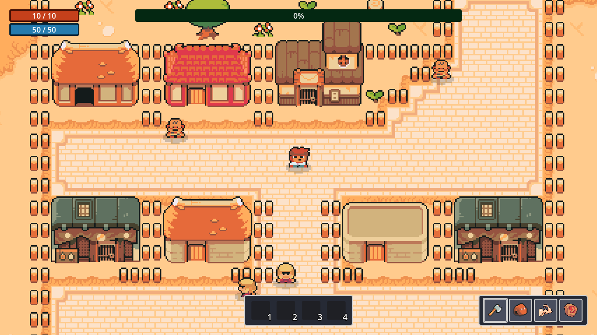
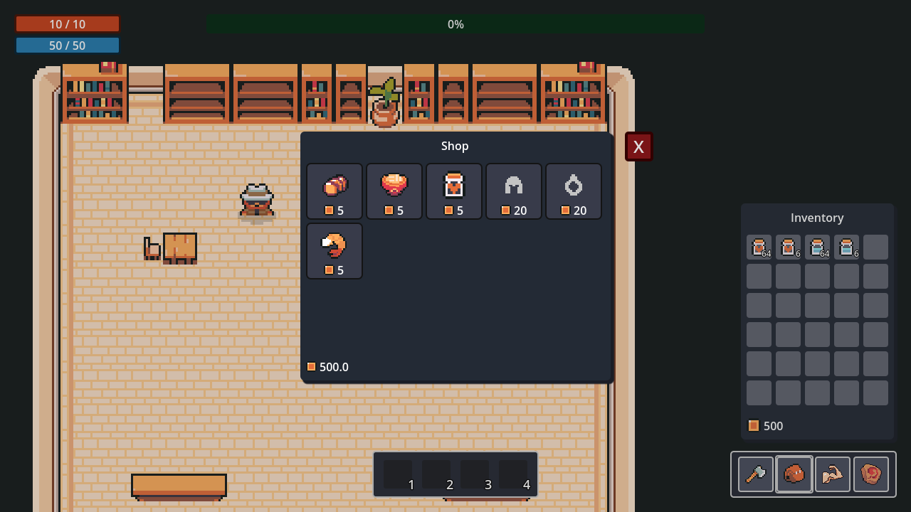
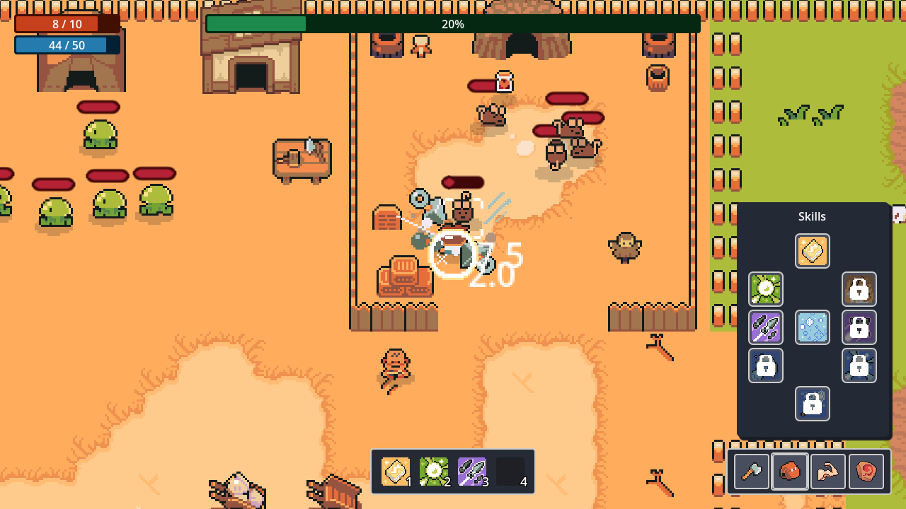

A Godot project following a 2D RPG Udemy tutorial

[Godot 2D Academy: Create a 2D RPG Game with Godot 4](https://www.udemy.com/course/godot-2d-academy-create-a-2d-rpg-game-with-godot-4)

## Chapters
- [x] 01 Introduction
- [x] 02 Create_Player
- [x] 03 Build_Town
- [x] 04 Create_Panels_UI
- [x] 05 Inventory
- [x] 06 Player_Stats
- [x] 07 Create_Enemies
- [x] 08 Add_Skills
- [x] 09 NPCs
- [x] 10 Shop
- [x] 11 Crafting
- [x] 12 Quest
- [x] 13 Sound_Manager

## Screenshots

